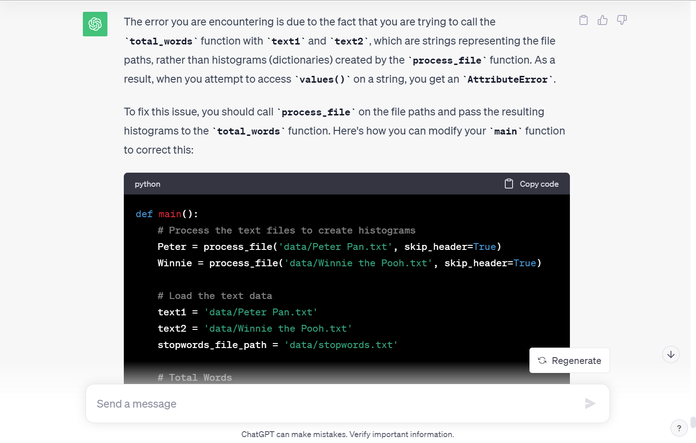
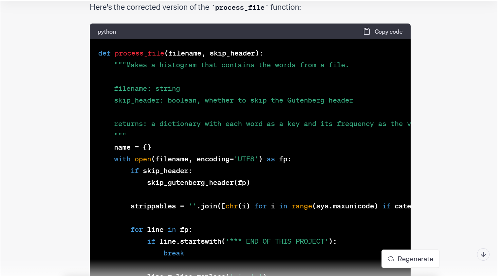
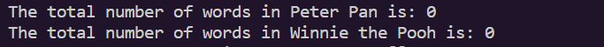
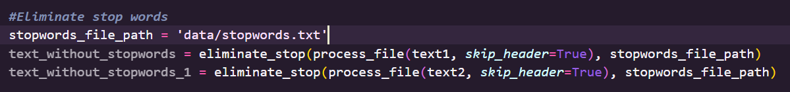
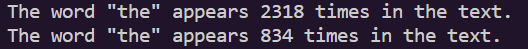
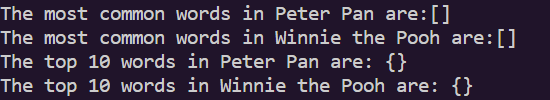
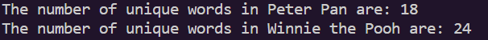
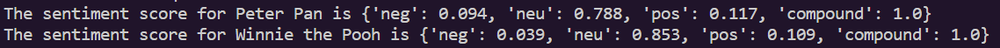

# Text-Analysis-Project
 
Please read the [instructions](instructions.md).

# Project Overview
For my Assignment 2 I decided to use 2 texts from the Gutenberg library,
http://www.gutenberg.org/, and imported urllib.request in a seperate file.
I decided to specifically use Peter Pan and Winnie the Pooh as they were 
my favorite childhood stories growing up. I wanted to have the opportunity 
to try to compare the two texts and see figure out what makes them unique. 
I attempted to use multiple funcitons in order to achieve this goal but I 
was only successfully able to run 3 out of my 6 functions.I've tried implementing 
ChatGPT to help me figure outwhat my errors are and explain them to me. For my
attempt to analyze these two books, I attempted to find the total number of words,
how many times "the" appears in eachtext, the most common words,the top 10 words,
and number of unique words. I also attempt to find the sentiment score as well as 
the text similarity score. The outcome I had wished for was to do a comparison
between the texts although the lengths of each book are very different.

# Implementation

Firstly I imported urlib.request to make sure the text files were downloaded 
for my Assignment. Then I attempted to process the files using the process_file 
function while also adding the skip_header function. Processing the files this was 
would exclude the header and ending. I also attempted to remove stop words for the 
most-common function. When figuring out the data that I wanted to work on most, I 
had a difficult time deciding what kind of analysis I wanted to make. Meaning what 
functions would provide the most beneficial and useful outputs. Although some of my 
functions do not generate the answer I would like, I still find the use of them helpful, 
in the chance I can figure out what may be wrong with it, I'll be able to successfully
generate the answers I want from the functions I created. 

While we were able to use ChatGPT for our Assignment, I found that it didn't help me 
fix many errors I had when running my code. I specified what error I was recieving and 
asked ChatGPT for recommendations on howto fix it. After I implemented their tips, I re-entered 
the code and it did not help me fix the errors I had. I ensured I downloaded all packages 
but there may be some steps I missed that could be easily fixed. Below is a screenshot 
of one of my sample answers I recieved using ChatGPT:

Though throughout working on my project I realized it could be because there 
really isn't any error, it's just I might have not processed the files correctly. 

# Results

The first function I decided to use to analyze the texts was my total words function. 
The purpose of the function was to return the word frequencies. I kept running into an 
error saying that str’does not have value. Meaning the variable I used in the processing 
file function, Name, did not have a value. I put the print statements for the function 
in my main function but every time I run the code it says 0 for both texts. I made sure 
to have one process each text file and open it in the data file of my repository. I 
asked ChatGPT what the error I kept receiving meant and what were ways I could fix it 
(i.e by checking if I imported the correct files, did I download them properly, etc.). 
But ChatGPT’s recommendations were not able to help me figure out the issue with my code. 

Next I created a function that eliminates and takes out the stop words in the texts 
I decided to use. First I had to open a file path to my stop words.txt file and then 
create a variable to extract the stop words from the files. I also created a variable 
for filtered words and the purpose of the function is to eliminate the stop words. 

While working on this Assignment I wanted to know how often “the” was used in each 
text. I was curious and decided to do this analysis because we know e is the most common 
letter used. So I wanted to see how often each text used the word “the” since it’s a 
commonly used word. My function was able to successfully print the amount of times the
word was used for each text. We can see that Peter Pan uses the word almost x3 times 
more. This would sense as Peter Pan contains more words than Winnie the Pooh. 

I attempted to print out the most ocmmonowrds used in both texts but I was not able to get
any generated response for this. This is also applicable to trying to find the top 10 words
as I couldn't get the code to generate it. I have included screenshots of it below:

When trying to figure out other ways to analyze my data, I wanted to try to find how many 
unique words each text had. Although the length of the 2 texts are very different they have
a similar amount of unique words which were 18 and 24. This is also interesting considering 
these are childrens texts, that they have pretty similar amounts.

Though it wasn't required to do the sentiment score is designed to analyze the sentiment or 
emotional tone of a text. It calculates a polarity score that measures the positivity, negativity, 
and neutrality of the text, as well as a compound score that represents the overall sentiment. 
When running this function it outputs the neg score, neutral score, positive score and compound 
score. Peter Pan has a negativity score of 0.094, and Winnie the Pooh has a score of 0.039. A lower value suggests lower negativity. Peter Pan has a neutrality score of 0.788, and Winnie the Pooh 
has a score of 0.853. A higher value would suggest a more neutral tone. For a positive score, 
Peter Pan's score is 0.117 and the score for Winnie the Pooh is 0.109. A higher value would 
suggest a more positive tone. Finally the compount score for Peter Pan is 1 and it is also 1 for 
Winnie the Pooh. This suggests that both Peter Pan and Winnie the Pooh have a highly positive overall sentiment, as the compound score of 1.0 indicates a very positive tone.

For my last function I wanted to try to find the similarity score. The higher the similarity score, the more similar the texts are, with a maximum score of 100 indicating the texts are identical. When running
the function we get a text similarity score of 67 between Peter Pan and Winnie the Pooh. Meaning the texts are pretty similar to one another but not completely. This is surprising as I expected the similarity score to be much higher than the output I was given. I expected it to be higher because they are both childrens texts so the words should be very similar. 

# Reflection

Overall this project went semi-ok. It didn't go completely well as I had hoped mainly because I thought after processing the files and then revising my functions using ChatGPT, my code would run. I'm honestly just glad that even some of my code worked. I think my plan going into the assignment changed a lot while I worked on it because I used a lot of references, sources, videos and examples on how to fix my functions. What I really want to improve in my assignment is to figure out how to get all of mycode to run properly. I've looked at people who have asked similar questions on stack overflow but the answers in the comment section were a little too advanced for me to understand. Basically I would say the project went alright.

